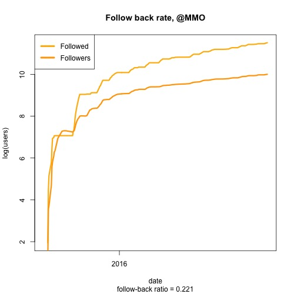
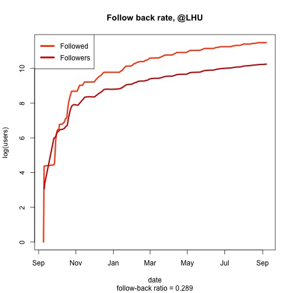
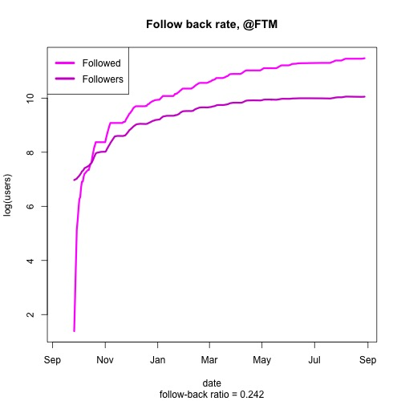
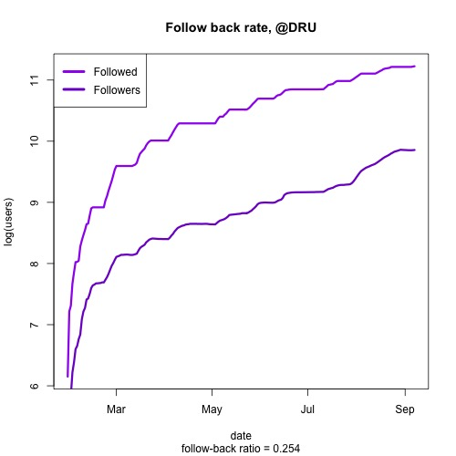
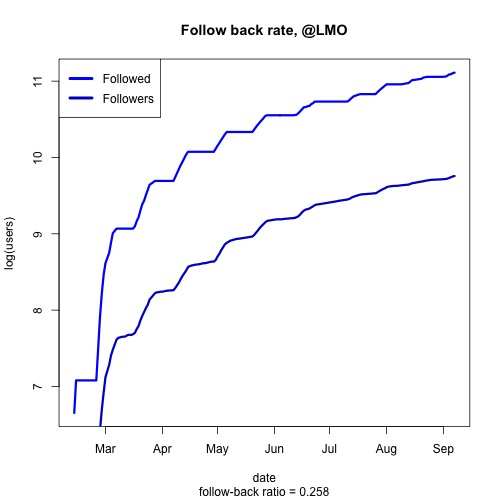

# [in progress] Instagram account growth

This code produces plots analyzing of the growth of my Instagram accounts from September 2015 to September 2016.

I had five datasets laying around for five of my main Instagram accounts. 

I use abbreviated names to protect the identity of the accounts, but I provide each account's niche below: 

- **@MMO**: Motivation for entrepreneurs
- **@LHU**: Fitness/gym humour
- **@FMT**: Soccer/Football humour
- **@DRU**: Partying/Drinking humour
- **@LMO**: Fitness motivation

Data for @MMO, @LHU and @FMT begins at the time the accounts were created. 

Data for @DRU and @LMO were not collected until early 2016. This was after the accounts already had substatial followings.

The growth of the accounts is plotted below. 

The main strategy for growing the accounts is a three step process:

1. Look for similar accounts in my niche and scrape the usernames of users who interacted with those accounts. 
2. Follow those users until 7500 following limit. 
3. Unfollow all users until at 0 following. 

This is a cheap and easy way of advertising oneself on Instagram. By sending a user a notification that you have followed them, you are advertising yourself to them.

The following plots show the total number of followings given out by the five accounts as well as the total number of followers at that time. 

Note the follow-back ratio at the bottom of each plot. The follow-back ratio is a good way of determining how well you are targetting users. That is, an account with a high follow-back ratio is one that is advertising itself to a suitable audience. 

_TODO_ Daily gains time series