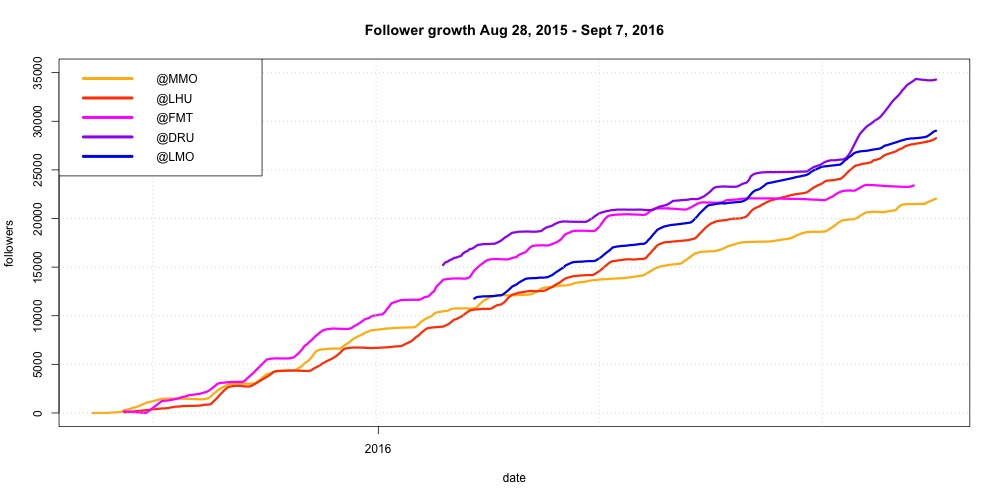

# [in progress] Instagram account growth

This code produces plots analyzing of the growth of my Instagram accounts from September 2015 to September 2016.

I had five datasets laying around for five of my main Instagram accounts. 

I use abbreviated names to protect the identity of the accounts, but I provide each account's niche below: 

- **@MMO**: Motivation for entrepreneurs
- **@LHU**: Fitness/gym humour
- **@FMT**: Soccer/Football humour
- **@DRU**: Partying/Drinking humour
- **@LMO**: Fitness motivation

Data for @MMO, @LHU and @FMT begins at the time the accounts were created. 

Data for @DRU and @LMO were not collected until early 2016. This was after the accounts already had substatial followings.

The growth of the accounts is plotted below. 

_TODO_ Follow-back ratios

_TODO_ Daily gains time series